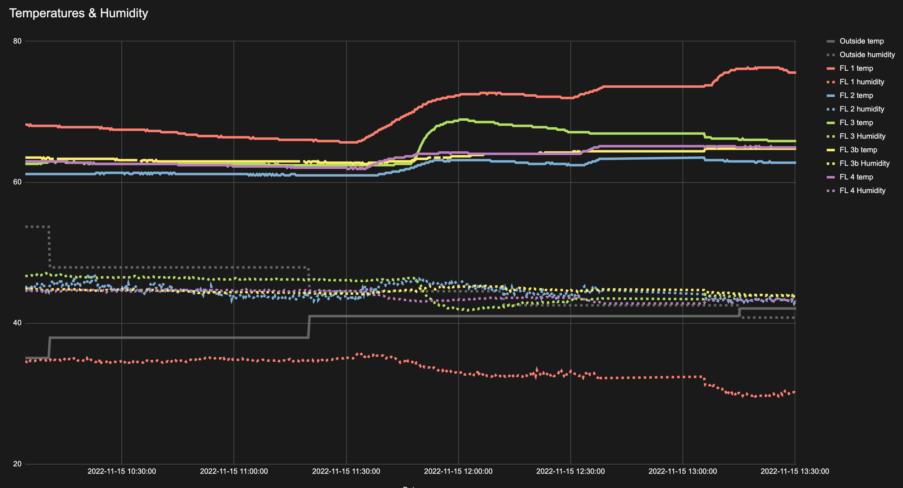

# Full apartment temperature and humidity monitoring
1. A network of Raspberry Pi Pico Ws with DHT22 sensors from which temperature and humidity data is served via http requests.
2. A centralized client which pulls data from the Picos and dumps it into CSV files and Google Sheets.

## Pico Nanos
### Wiring the DHT22
This assumes that your DHT22s came with a board that includes a resistor on GPIO pin.

| DHT22 Pin | Pico Pin |
|:---:|:---:|
| + | 3V |
| GPIO | GP2 |
| - | GND |

### Pico Scripts
#### Install firmware
The Pico must be running rp2-pico firmware > 1.19.1. Right now, that's the nightly dev snapshot. Anything with `network`
and `socket` precompiled will do. See [this guide](https://projects.raspberrypi.org/en/projects/getting-started-with-the-pico/3) for instructions on installing the firmware.

#### Copy scripts
Once the firmware is in place:
1. Place a copy of `./picofiles/tempbotconfig.py` on the Pico with customized values for the WiFi SSID and password and unique identifier for the Pico.
2. Place a copy of `./picofiles/tempBot.py` on the Pico and rename it to `main.py`.

## Centralized Client
You need a client that's connected to the internet on the same network as the picos with PHP >= 8.1. `./scripts/run.php`
will poll each of the clients every ~20 seconds and write the results to a CSV file in the `./data` directory.

The script has hardcoded IP addresses for the Picos on my LAN, so you'll need to change those. It's also advisable to
statically assign IPs to the Picos via your DHCP server so the script knows where to find them.
