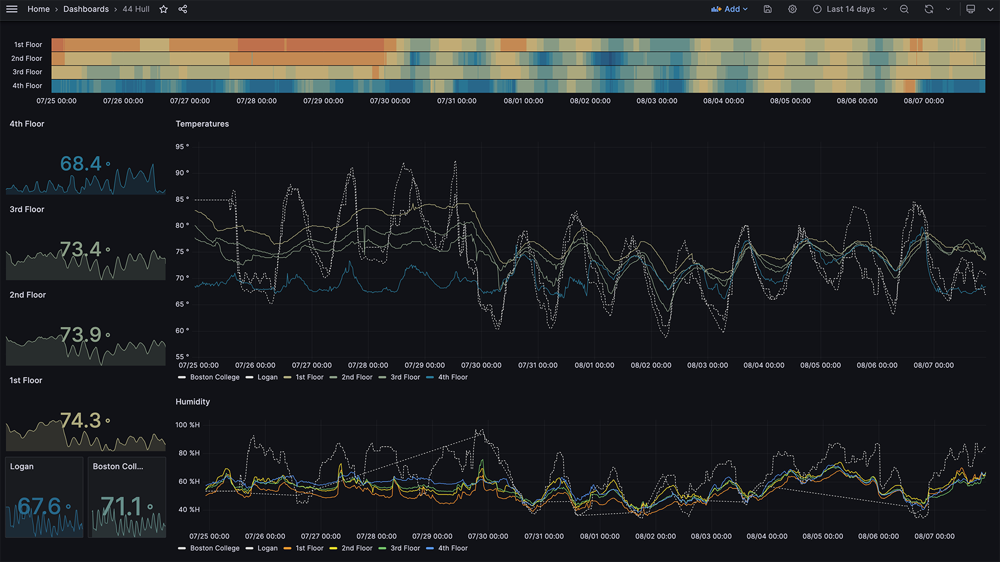
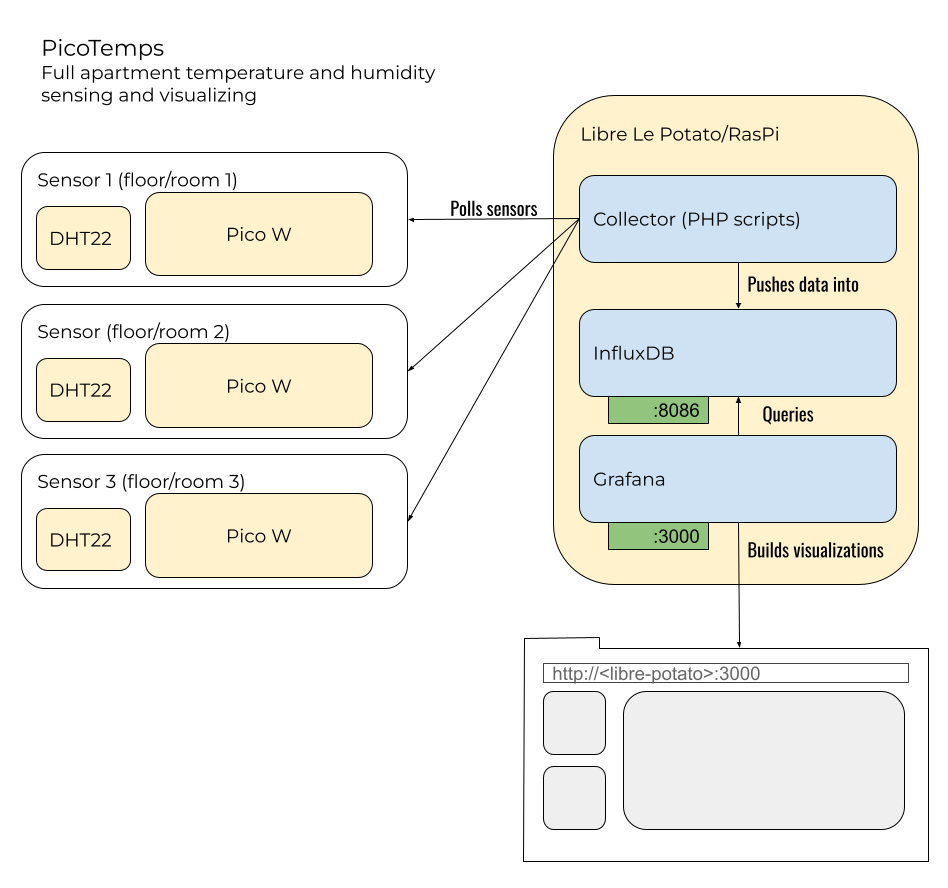

# Full home temperature and humidity monitoring
1. A network of Raspberry Pi Pico Ws with DHT22 sensors from which temperature and humidity data is served via http requests.
2. A centralized client which:
   1. Pulls data from the Picos
   2. Pushes that data into a local InfluxData instance
   3. Builds vizualizations for a web browser with Grafana

**Result:**


## Who it's for
Anyone who needs granular data on temperature and humidity throughout their home. This is especially useful for homes that span multiple floors or have multiple HVAC zones.

## The parts
1. [Sensors](#1-sensors) -> hardware
   1. Raspberry Pi Pico W
   2. DHT22
2. [Centralized client](#2-centralized-client) -> software
   1. [This repo](https://github.com/balsama/picotemps)
   2. [InfluxDB](https://www.influxdata.com/products/influxdb/)
   3. [Grafana](https://grafana.com/grafana/)

**Level 1 C4 model diagram of PicoTemps:**


### 1. Sensors
Each sensor consists of two pieces of hardware:
1. A [Raspberry Pi Pico W](https://www.amazon.com/Generic-Raspberry-Pi-Pico-W/dp/B0B72GV3K3)
2. A [DHT22](https://www.amazon.com/WWZMDiB-Digital-Temperature-Humidity-Measure-40-80%E2%84%83%EF%BC%88%C2%B10-5%E2%84%83%EF%BC%89/dp/B0BTVW39R2/ref=sr_1_6?crid=2Y2WO84YSC0VB)

#### Wiring the DHT22 to your Pico Ws
This assumes that your DHT22s came with a board that includes a resistor on GPIO pin.

| DHT22 Pin | Pico Pin |
|:---:|:---:|
| + | 3V |
| GPIO | GP2 |
| - | GND |

#### Pico Scripts
The `/picofiles` directory contains python files for the Raspberry Pi Pico Ws.

##### Install firmware
The Pico Ws must be running rp2-pico firmware > 1.19.1. Anything with `network` and `socket` precompiled will do. See
[this guide](https://projects.raspberrypi.org/en/projects/getting-started-with-the-pico/3) for instructions on installing the firmware.

##### Copy scripts
Once the firmware is in place:
1. Place a copy of `./picofiles/tempbotconfig.py` on the Pico with customized values for the WiFi SSID and password and unique identifier for the Pico.
2. Place a copy of `./picofiles/tempBot.py` on the Pico and rename it to `main.py`.

### 2. Centralized Client
You need a centralized client on the same network as the Pico Ws with PHP >= 8.1. In this case, we used a [Libre Computer Le Potato](https://www.amazon.com/Libre-Computer-AML-S905X-CC-Potato-64-bit/dp/B074P6BNGZ/?th=1); but any computer will do.

The client needs the following software:
1. **This repo and its dependencies** (including platform dependencies like PHP >= 8.1)
   ```
   $ git clone git@github.com:balsama/picotemps.git
   $ cd picotemps
   $ composer install 
   ```
2. **InfluxDB** | See https://portal.influxdata.com/downloads/ for detailed instructions. Below is an example for ARM64 Ubuntu.
   ```
   $ wget -q https://repos.influxdata.com/influxdata-archive_compat.key
   $ echo '393e8779c89ac8d958f81f942f9ad7fb82a25e133faddaf92e15b16e6ac9ce4c influxdata-archive_compat.key' | sha256sum -c && cat influxdata-archive_compat.key | gpg --dearmor | sudo tee /etc/apt/trusted.gpg.d/influxdata-archive_compat.gpg > /dev/null
   $ echo 'deb [signed-by=/etc/apt/trusted.gpg.d/influxdata-archive_compat.gpg] https://repos.influxdata.com/debian stable main' | sudo tee /etc/apt/sources.list.d/influxdata.list
   $ sudo apt-get update && sudo apt-get install influxdb2
   ```
3. **Grafana** | See https://grafana.com/grafana/download/ for detailed instructions. Below is an example for ARM64 Ubuntu
   ```
   $ sudo apt-get install -y adduser libfontconfig1
   $ wget https://dl.grafana.com/oss/release/grafana_10.0.3_arm64.deb
   $ sudo dpkg -i grafana_10.0.3_arm64.deb
   ```

## Configuration
Copy the `config/example.config.yml` file to `config/config.yml` and edit to match your setup. At a minimum, you will need to set values for:
1. sensors (`sensor_id: ip_address`)
2. influx (`influx_url` and `influx_token`) - the InfluxDB token can be generated from the InfluxDB web interface which can be found at port :8086 of the host machine by default.

## Running/collecting
`./scripts/run.php` will poll each of the clients every ~20 seconds and push the data to InfluxDB. Or you can use `scripts/run_once.php` and call it periodically via cron.

## Viewing the data
A sample Grafana dashboard is exported in JSON at `grafana/grafana_dashboard_config.json`. It will need to be tweaked to match your sensor IDs/rooms, but could be used as a starting point. The threshold mappings for temperature color coding could be especially useful.
